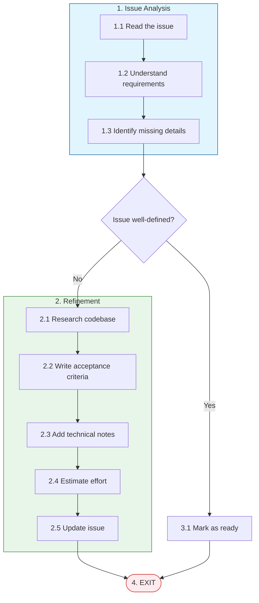

# Refine Issue Workflow

**Trigger**: You are in refine mode with a task to analyze and enhance

## Path Overview

## Steps

### 1. Issue Analysis

1.1. **Read the Issue**
   - Fetch the full issue details using the task manager
   - Read the title, description, and any existing labels/comments

1.2. **Understand Requirements**
   - Identify the user-facing goal
   - Note any technical constraints mentioned
   - List any dependencies on other issues

1.3. **Identify Missing Details**
   - Is the scope clearly defined?
   - Are success criteria specified?
   - Is there enough technical context?

### 2. Refinement (if needed)

2.1. **Research the Codebase**
   - Identify relevant files and modules
   - Understand existing patterns and conventions
   - Note any related code or prior implementations

2.2. **Write Acceptance Criteria**
   - Define clear, testable success criteria
   - Use "Given/When/Then" format when appropriate
   - Include edge cases and error scenarios

2.3. **Add Technical Notes**
   - List files likely to be modified
   - Note any architectural considerations
   - Identify potential risks or challenges
   - Suggest implementation approach

2.4. **Estimate Effort**
   - Provide a rough complexity estimate (S/M/L/XL)
   - Note any unknowns that could affect the estimate

2.5. **Update the Issue**
   - Add a comment with the refined details
   - Update labels as appropriate (e.g., add "ready-for-dev")
   - Link any related issues

### 3. Mark as Ready

3.1. If the issue was already well-defined, simply confirm it's ready for development and add appropriate labels.

### 4. Exit

Close the task and EXIT.
