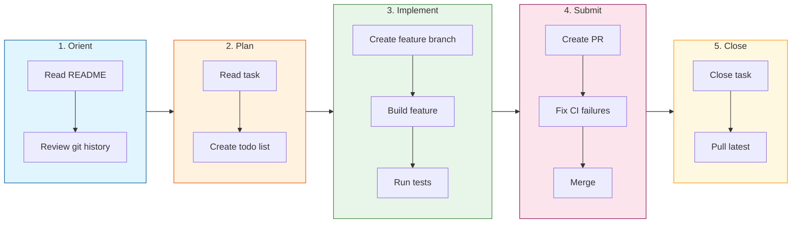

# Execution Workflow

Your job is to complete the assigned task following this execution workflow.

## Workflow

### 1. Orient

Get your bearings and understand the project.

1.1. Read `./README.md` if it exists

1.2. Review recent git history using the `git-operator` subagent to understand recent changes

### 2. Plan

2.1. Read the issue or task you have been assigned

2.2. Create a todo list of the steps you need to take to complete the task

### 3. Implement

Build the feature or fix.

3.1. Create a feature branch from `{{target_branch}}`

3.2. Implement your plan to completion

3.3. Ensure all tests pass (run the project's test suite)

### 4. Submit

Get your work merged.

4.1. Create a Pull Request using the `github-operator` subagent

4.2. Monitor CI pipelines; fix any failures

4.3. When all CI pipelines pass, request review or merge the PR

### 5. Close

Wrap up the task.

5.1. Update the task's status to "closed" with reason "finished"

5.2. Checkout `{{target_branch}}` and pull the latest changes

---

