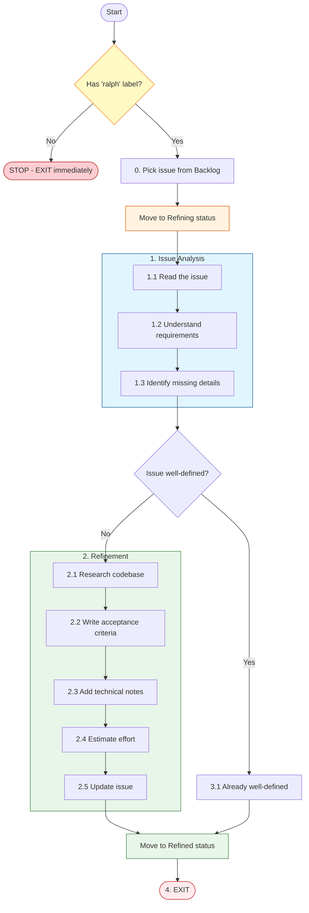

# Refine Issue Workflow

**Trigger**: You are in refine mode with a task to analyze and enhance

---

## CRITICAL CONSTRAINT

> **ONLY work with issues that have the `ralph` label.**
>
> - You MUST verify the issue has the `ralph` label before ANY action
> - NEVER read, modify, or interact with issues without the `ralph` label
> - If an assigned issue lacks the `ralph` label, STOP and EXIT immediately
> - This constraint applies to ALL operations: reading, commenting, status changes, etc.

---

## Status Flow

```
Backlog → Refining → Refined
```

- **Backlog**: Issues awaiting refinement (source)
- **Refining**: Issue currently being analyzed and enhanced (work-in-progress)
- **Refined**: Issue fully refined and ready for development (complete)

## Path Overview



## Steps

### 0. Verify Label and Start Issue

0.1. **Verify `ralph` Label (MANDATORY)**
   - Check that the assigned issue has the `ralph` label
   - If the label is NOT present: **STOP immediately and EXIT**
   - Do NOT proceed with any other steps if the label is missing
   - This check is non-negotiable and must be performed first

0.2. **Select Issue from Backlog**
   - Pick the assigned issue (should already be in "Backlog" status)
   - Verify it needs refinement

0.3. **Move to Refining Status**
   - Update the issue status from "Backlog" to "Refining"
   - This signals that refinement work is in progress

### 1. Issue Analysis

1.1. **Read the Issue**
   - Fetch the full issue details using the task manager
   - Read the title, description, and any existing labels/comments

1.2. **Understand Requirements**
   - Identify the user-facing goal
   - Note any technical constraints mentioned
   - List any dependencies on other issues

1.3. **Identify Missing Details**
   - Is the scope clearly defined?
   - Are success criteria specified?
   - Is there enough technical context?

### 2. Refinement (if needed)

2.1. **Research the Codebase**
   - Identify relevant files and modules
   - Understand existing patterns and conventions
   - Note any related code or prior implementations

2.2. **Write Acceptance Criteria**
   - Define clear, testable success criteria
   - Use "Given/When/Then" format when appropriate
   - Include edge cases and error scenarios

2.3. **Add Technical Notes**
   - List files likely to be modified
   - Note any architectural considerations
   - Identify potential risks or challenges
   - Suggest implementation approach

2.4. **Estimate Effort**
   - Provide a rough complexity estimate (S/M/L/XL)
   - Note any unknowns that could affect the estimate

2.5. **Update the Issue**
   - Add a comment with the refined details
   - Link any related issues
   - **Do NOT remove the `ralph` label** - it must remain on the issue

### 3. Mark as Ready

3.1. If the issue was already well-defined, confirm it's ready for development.

### 4. Complete and Exit

4.1. **Move to Refined Status**
   - Update the issue status from "Refining" to "Refined"
   - This signals the issue is fully refined and ready for development

4.2. **Exit**
   - Close the task and EXIT
