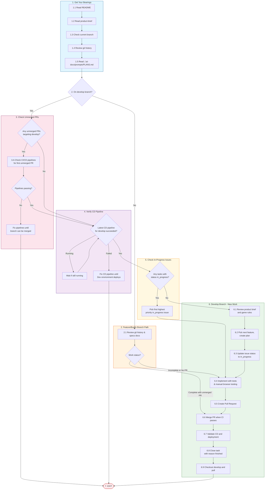

# Task

Your job is to complete the implementation of the MVP of the Background Assassins web application.

## Workflow

1. Get your bearings and understand what work is in progress.

    1.1. Read `./README.md`
    
    1.2. Read `./.ai-docs/design/product-brief.md`

    1.3. Check the branch you have checked out currently
    
    1.4. Review git history

    1.5. Read `././.ai-docs/prompts/PLANS.md` to understand the planning for this project.

2. IF you are NOT in the `develop` branch (if you are in a feature or bugfix branch):

    2.1. Look through recent git history and the relevant document(s) in `./specs/background-assassins/` to understand the status of your current work item.
    2.2. If it is incomplete (and/or if there is no Pull Request), proceed to step 2.B.3. and continue from there.
    2.3. If it is complete and there is an existing Pull Request created but NOT merged, proceed to step 2.B.5. and continue from there.

3. Verify that there are no unmerged and open PRs targeting the `develop` branch. If there ARE any unmerged and open PRs, for the first unmerged PR targeting the `develop` branch:

    3.A. Check the status of the latest GitHub CI/CD pipelines for the target PR. If any have failed, your PRIME DIRECTIVE is to fix the pipeline so that the branch can be merged. Once they are fixed and the branch is merged, EXIT. If the latest runs of all pipelines have succeeded, proceed to the next step.
    -> 3. EXIT

4. Verify that the latest CD pipelines targeting the `develop` branch has succeeded. If the latest CD pipeline targeting the `develop` branch is still running, wait for it to finish. If there ARE any unmerged and open PRs, for the first unmerged PR targeting the `develop` branch, your PRIME DIRECTIVE is to fix the pipeline so that the application will be deployed. Once they are fixed and the Dev environment is deployed, EXIT. If the latest CD pipelines targeting the `develop` branch has succeeded, proceed to the next step.

5. IF you ARE in the `develop` branch and there are ANY tasks with a status of "in_progress": Pick the first highest priority issue you find that has a status of "in_progress". This is now the issue you're working on. Skip to 6.4. and continue from there.

6. IF you ARE in the `develop` branch and there are NO tasks with a status of "in_progress":

    6.1. Review the product brief in `./.ai-docs/design/product-brief.md` and the game rules in `./.ai-docs/design/game-rules.md` to understand the product and the game rules.
    6.2. Pick a next most important feature, change, or fix to implement. Use `./.ai-docs/prompts/PLANS.md` to create a new implementation plan for your chosen task.
    6.3. Update your issue's status to "in_progress" if it has not already been updated.
    6.4. Implement your plan to completion. All tests should be passing, and you should have manually tested the application in a web browser using the Chrome DevTools MCP tools.
    6.5. Create a Pull Request (using the `github-operator` subagent) for your work.
    6.6. When all CI pipelines are successful, merge your PR into `develop` using the `github-operator` subagent.
    6.7. Validate that all CD pipelines run successfully after your PR is merged, and that the app is successfully deployed to Vercel (`develop` will deploy to the dev environment).
    6.8. Update your `bd` issue's status to "closed" with a reason of "finished", and push that change (this will NOT trigger a new CI pipeline run).
    6.9. Checkout `develop` locally and pull the latest changes from `develop`.

7. EXIT.

### Workflow Diagram

