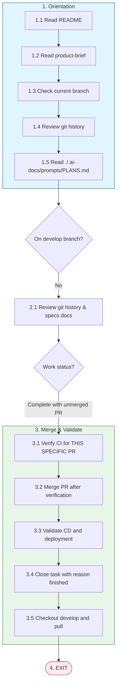

# Feature Branch - PR Ready to Merge

**Trigger**: You are on a feature/bugfix branch with complete work and an existing unmerged Pull Request

## Path Overview

## Steps

### 1. Orientation (Always First)

1.1. Read `./README.md`

1.2. Read `./.ai-docs/design/product-brief.md`

1.3. Check the branch you have checked out currently

1.4. Review git history

1.5. Read `././.ai-docs/prompts/PLANS.md` to understand the planning for this project.

### 2. Feature Branch Assessment

2.1. Look through recent git history and the relevant document(s) in `./specs/background-assassins/` to understand the status of your current work item.

2.2. Confirm work is complete and there is an existing Pull Request created but NOT merged.

### 3. Merge and Validate

3.1. **Verify CI pipelines have passed FOR YOUR SPECIFIC PR**:

   ⚠️ **CRITICAL**: You must verify that the CI results belong to YOUR PR, not a different PR from the same branch.

   Use the `github-operator` subagent with explicit instructions to:
   - Check `gh pr view <your-pr-number> --json number,headRefName,statusCheckRollup`
   - Verify `gh pr checks <your-pr-number>` shows ALL checks passing
   - Cross-validate that any CI run IDs belong to YOUR PR number (not a different PR)

   **DO NOT** merge if:
   - Any check is failing, pending, or skipped
   - The CI run output references a different PR number than the one you're merging

3.2. **Merge PR** using the `github-operator` subagent only AFTER completing 3.1 verification.

3.3. Validate that all CD pipelines run successfully after your PR is merged, and that the app is successfully deployed to Vercel (`develop` will deploy to the dev environment).

3.4. Update your task's status to "closed" with a reason of "finished".

3.5. Checkout `develop` locally and pull the latest changes from `develop`.

### 4. Exit

EXIT.
