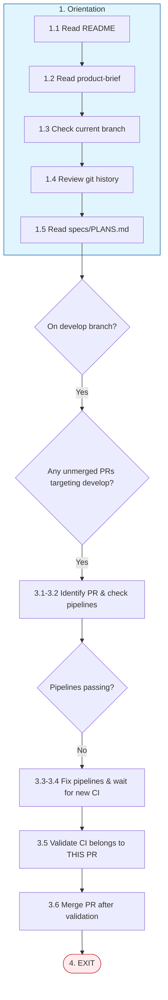

# PR Pipeline Fix

**Trigger**: You are on the develop branch and there are unmerged PRs with failing CI/CD pipelines

**Prime Directive**: Fix the pipeline so that the branch can be merged

## Path Overview

## Steps

### 1. Orientation (Always First)

1.1. Read `./README.md`

1.2. Read `./.ai-docs/design/product-brief.md`

1.3. Check the branch you have checked out currently

1.4. Review git history

1.5. Read `./specs/PLANS.md` to understand the planning for this project.

### 2. Verify Conditions

2.1. Confirm you ARE in the `develop` branch

2.2. Verify there ARE unmerged and open PRs targeting the `develop` branch

### 3. Fix PR Pipeline

3.1. **Identify the specific PR** you are fixing. Note the PR number explicitly (e.g., PR #27).

3.2. Check the status of the latest GitHub CI/CD pipelines for that specific PR.

3.3. If any have failed, your **PRIME DIRECTIVE** is to fix the pipeline so that the branch can be merged.

3.4. After making fixes, **wait for the NEW CI run to complete** and verify it passed.

3.5. **Before merging, perform mandatory PR validation**:

   ⚠️ **CRITICAL**: You must verify that the passing CI results belong to THE SAME PR you are merging. This is a common source of errors when multiple PRs exist from the same branch.

   Use the `github-operator` subagent with explicit instructions to follow the **PR Merge Validation Protocol**:

   a. Verify `gh pr view <pr-number> --json number,headRefName,statusCheckRollup` shows the correct PR
   b. Verify `gh pr checks <pr-number>` shows ALL checks passing
   c. Cross-validate: Check `gh run list --branch <branch-name>` and confirm the passing run explicitly references YOUR PR number

   **STOP AND DO NOT MERGE IF**:
   - The CI run output shows a different PR number (e.g., you see "#28" but you're merging #27)
   - Any check is still failing, pending, or skipped
   - You cannot confirm the check results belong to your specific PR

3.6. **Merge the PR** using the `github-operator` subagent only AFTER completing step 3.5 validation.

### 4. Exit

EXIT.
