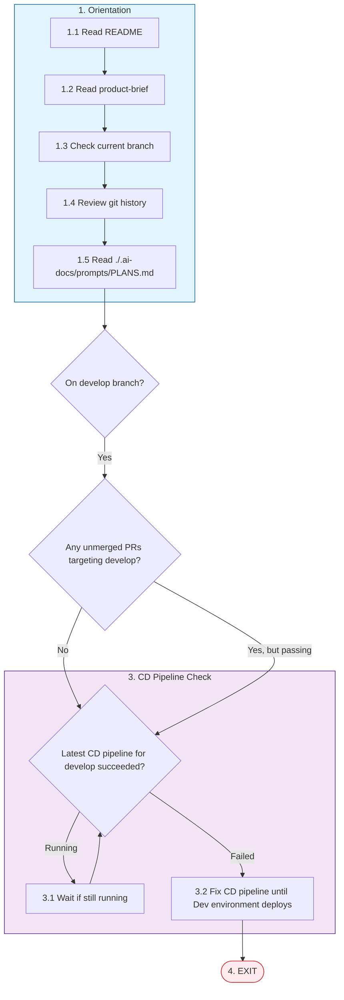

# CD Pipeline Fix

**Trigger**: You are on the develop branch and the CD pipeline for develop has failed

**Prime Directive**: Fix the pipeline so that the application will be deployed

## Path Overview

## Steps

### 1. Orientation (Always First)

1.1. Read `./README.md`

1.2. Read `./.ai-docs/design/product-brief.md`

1.3. Check the branch you have checked out currently

1.4. Review git history

1.5. Read `././.ai-docs/prompts/PLANS.md` to understand the planning for this project.

### 2. Verify Conditions

2.1. Confirm you ARE in the `develop` branch

2.2. Verify there are NO unmerged and open PRs targeting develop (or they all have passing pipelines)

### 3. Check and Fix CD Pipeline

3.1. Verify that the latest CD pipeline targeting the `develop` branch has succeeded.

3.2. If the latest CD pipeline is still running, **wait for it to finish**.

3.3. If the CD pipeline has **failed**, your **PRIME DIRECTIVE** is to fix the pipeline so that the application will be deployed.

3.4. Once the Dev environment is successfully deployed, proceed to exit.

### 4. Exit

EXIT.
