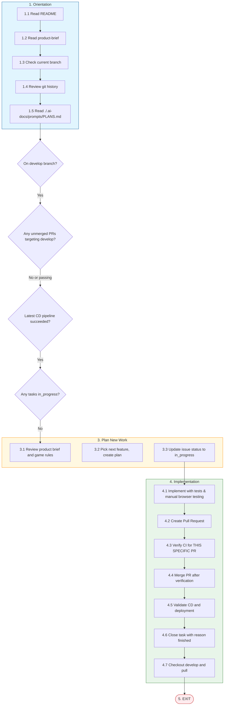

# New Work

**Trigger**: You are on the develop branch with no in_progress issues and all pipelines passing

## Path Overview

## Steps

### 1. Orientation (Always First)

1.1. Read `./README.md`

1.2. Read `./.ai-docs/design/product-brief.md`

1.3. Check the branch you have checked out currently

1.4. Review git history

1.5. Read `././.ai-docs/prompts/PLANS.md` to understand the planning for this project.

### 2. Verify Conditions

2.1. Confirm you ARE in the `develop` branch

2.2. Verify there are no failing PR pipelines

2.3. Verify the CD pipeline for develop is passing

2.4. Verify there are NO tasks with status "in_progress"

### 3. Plan New Work

3.1. Review the product brief in `./.ai-docs/design/product-brief.md` and the game rules in `./.ai-docs/design/game-rules.md` to understand the product and the game rules.

3.2. Pick a next most important feature, change, or fix to implement. Use `./.ai-docs/prompts/PLANS.md` to create a new implementation plan for your chosen task.

3.3. Update your issue's status to "in_progress" if it has not already been updated.

### 4. Implementation

4.1. Implement your plan to completion. All tests should be passing, and you should have manually tested the application in a web browser using the Chrome DevTools MCP tools.

4.2. Create a Pull Request (using the `github-operator` subagent) for your work.

4.3. **Verify CI pipelines have passed FOR YOUR SPECIFIC PR**:

   ⚠️ **CRITICAL**: You must verify that the CI results belong to YOUR PR, not a different PR from the same branch.

   Use the `github-operator` subagent with explicit instructions to follow the **PR Merge Validation Protocol**:
   - Check `gh pr view <your-pr-number> --json number,headRefName,statusCheckRollup`
   - Verify `gh pr checks <your-pr-number>` shows ALL checks passing
   - Cross-validate that any CI run IDs belong to YOUR PR number (not a different PR)

   **DO NOT** merge if:
   - Any check is failing, pending, or skipped
   - The CI run output references a different PR number than the one you're merging

4.4. **Merge PR** using the `github-operator` subagent only AFTER completing 4.3 verification.

4.5. Validate that all CD pipelines run successfully after your PR is merged, and that the app is successfully deployed to Vercel (`develop` will deploy to the dev environment).

4.6. Update your task's status to "closed" with a reason of "finished".

4.7. Checkout `develop` locally and pull the latest changes from `develop`.

### 5. Exit

EXIT.
