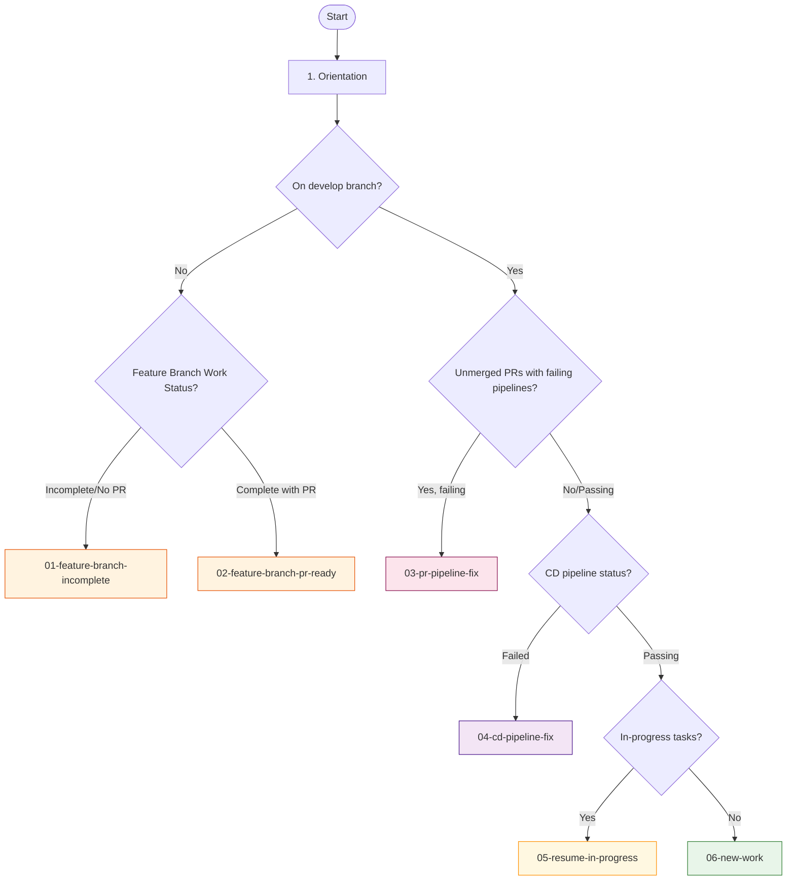

# Workflow Paths

This directory contains the distinct workflow paths extracted from the main workflow in `../prompt.md`. Each file represents a complete path through the decision tree based on the initial conditions.

## Decision Tree Summary

## Workflow Files

| # | File | Trigger | Main Concern |
|---|------|---------|--------------|
| 01 | [feature-branch-incomplete](./01-feature-branch-incomplete.md) | On feature branch with incomplete work | Continue implementation |
| 02 | [feature-branch-pr-ready](./02-feature-branch-pr-ready.md) | On feature branch with complete work & unmerged PR | Merge PR |
| 03 | [pr-pipeline-fix](./03-pr-pipeline-fix.md) | On develop with failing PR pipelines | Fix CI/CD to unblock merge |
| 04 | [cd-pipeline-fix](./04-cd-pipeline-fix.md) | On develop with failing CD pipeline | Fix deployment |
| 05 | [resume-in-progress](./05-resume-in-progress.md) | On develop with in_progress tasks | Continue existing work |
| 06 | [new-work](./06-new-work.md) | On develop with nothing in progress | Start new feature/fix |

## Quick Reference

**If you're NOT on develop branch:**
- Incomplete work → [01-feature-branch-incomplete](./01-feature-branch-incomplete.md)
- Ready to merge → [02-feature-branch-pr-ready](./02-feature-branch-pr-ready.md)

**If you ARE on develop branch:**
- PR pipelines failing → [03-pr-pipeline-fix](./03-pr-pipeline-fix.md)
- CD pipeline failing → [04-cd-pipeline-fix](./04-cd-pipeline-fix.md)
- Has in_progress issues → [05-resume-in-progress](./05-resume-in-progress.md)
- Ready for new work → [06-new-work](./06-new-work.md)
