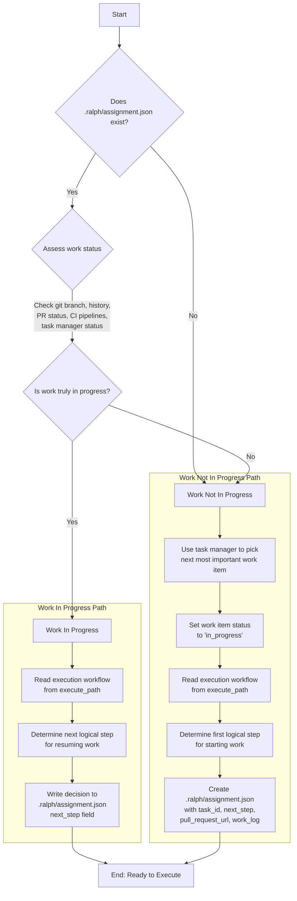

# Task

Your job is to determine the place to pick up work for a work item according to an execution workflow. It is possible that no work has been done, and it is possible that work is in-progress and should be resumed where it left off.

You will use the `.ralph/assignment.json` file to track the work item that is in progress. If this file does not exist, it means that no work has been done. If this file exists, it means that work MIGHT be in-progress, and you must assess where to pick up work from.

## Orchestration Workflow

1. Determine if a `.ralph/assignment.json` file exists. And if a `.ralph/assignment.json` file exists, determine if the work is truly in-progress or if it was already completed. Use the current git branch, git history (with the `git-operator` subagent), outstanding PR status, outstanding PR CI pipelines statuses, the task manager work item status (see instructions below), and other contextual clues to determine the current state.

### 2. IFF Work Is In Progress

If work is in progress, you should:

2.1. Read the execution workflow stored in `{{execute_path}}` and determine the next logical step for resuming work.

2.2. Write your decision (in detail) to the `.ralph/assignment.json` file in the `next_step` field (overwriting the existing `next_step` value).

### 3. IFF Work Is Not In Progress

If work is not in progress, you should:

3.1. Use the task manager (see instructions below) to pick the next most important work item to work on.

3.2. Set the status of the work item to "in_progress" in the task manager.

3.3. Read the execution workflow stored in `{{execute_path}}` and determine the first logical step for starting work.

3.4. Create (overwriting any existing) the `.ralph/assignment.json` file with the following structure:
   
   ```json
   {
     "task_id": "<task-identifier>",
     "next_step": "<next_step>",
     "pull_request_url": null,
     "work_log": []
   }
   ```

## Orchestration Workflow Diagram



{{!TASK_MANAGER_INSTRUCTIONS}}
