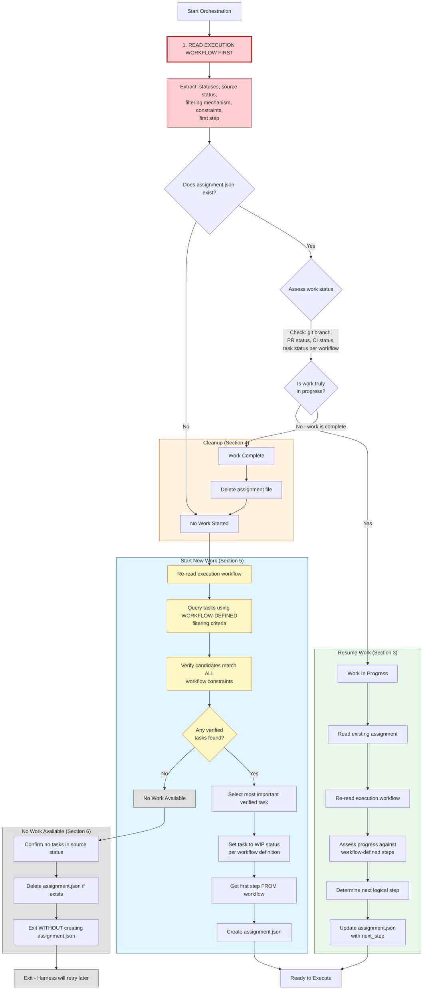

# Task

Your job is to determine the place to pick up work for a work item according to an execution workflow. It is possible that no work has been done, and it is possible that work is in-progress and should be resumed where it left off.

You will use the `assignment.json` file (located in the same directory as the `{{execute_path}}` workflow) to track the work item that is in progress. The assignment file path is: `{{assignment_path}}`. If this file does not exist, it means that no work has been done. If this file exists, it means that work MIGHT be in-progress, and you must assess where to pick up work from.

---

## CRITICAL: The Execution Workflow is Your Single Source of Truth

> **The execution workflow (`{{execute_path}}`) defines EVERYTHING about how tasks are selected, filtered, and processed.**
>
> You MUST NOT make assumptions about:
> - What statuses exist (e.g., "todo", "in-progress", "done" are NOT universal)
> - Which status means "available for work"
> - Which status means "work in progress"
> - Which status means "complete"
> - How to query or filter for tasks in each status
> - What the first step of the workflow is
>
> **ALWAYS read `{{execute_path}}` FIRST** to extract this information before taking any action.

---

## Orchestration Workflow

### 1. Read the Execution Workflow (MANDATORY FIRST STEP)

**You MUST read `{{execute_path}}` before doing anything else.** Extract the following information:

1.1. **Status Flow**: What statuses exist and in what order? Examples:
   - Some workflows use: `Backlog → In Progress → Done`
   - Others use: `Idea → Refining → Refined`
   - Others use labels: `open without "in-progress"` → `open with "in-progress"` → `closed`
   - The execution workflow will define this explicitly

1.2. **Source Status**: Which status indicates a task is available to be picked up?
   - This is the "starting" status in the workflow
   - Do NOT assume it is called "todo" or "open" or "backlog"
   - The execution workflow will specify this

1.3. **Work-In-Progress Status**: Which status indicates work is actively being done?
   - The execution workflow will specify this

1.4. **Complete Status**: Which status indicates the task is finished?
   - The execution workflow will specify this

1.5. **Filtering Mechanism**: HOW do you query for tasks in each status?
   - Is it based on labels? (e.g., `--label "in-progress"`)
   - Is it based on GitHub Project columns? (e.g., `gh project item-list ... | jq 'select(.status == "Idea")'`)
   - Is it based on issue state? (e.g., `--state open` vs `--state closed`)
   - The execution workflow will specify the exact mechanism

1.6. **Any Constraints**: Are there label requirements, project board requirements, or other filters?
   - Example: "Only work with issues that have the `ralph` label"
   - Example: "Use the 'Ralph TUI' GitHub Project for tracking"

1.7. **First Step**: What is the actual first step defined in the execution workflow?
   - Do NOT assume it is "Read README.md" - read the workflow to find out

---

### 2. Assess Current State

2.1. Check if the assignment file (`{{assignment_path}}`) exists.

2.2. If it exists, assess whether work is truly in progress or already completed. Gather evidence from:
   - Current git branch (is there a feature branch?)
   - Git history (recent commits related to the task?)
   - Pull request status (open, merged, or closed?)
   - CI pipeline status (passing, failing, or pending?)
   - Task manager status (is it still in the work-in-progress status as defined by the execution workflow?)

2.3. Based on your assessment, determine the current state:
   - **Work In Progress**: Assignment exists AND the task is actively being worked on
   - **Work Complete**: Assignment exists BUT the work appears finished (moved to complete status, PR merged, etc.)
   - **No Work Started**: Assignment does not exist

---

### 3. Handle: Work In Progress

If work is in progress, resume where you left off:

3.1. Read the existing assignment file to get the `task_id` and current `next_step`.

3.2. Re-read the execution workflow (`{{execute_path}}`) to understand the full workflow steps.

3.3. Assess progress against the execution workflow steps as defined in that document. Look at:
   - What steps does the execution workflow define?
   - Which steps have been completed based on evidence (commits, PRs, file changes)?
   - What is the next logical step?

3.4. Determine the next logical step for resuming work. Be specific and reference the actual step numbers/names from the execution workflow.

3.5. Update the assignment file (`{{assignment_path}}`) with your decision in the `next_step` field.

---

### 4. Handle: Work Complete

If the previous work was completed:

4.1. Delete the existing assignment file to clean up.

4.2. Proceed to section 5 (Handle: No Work Started) to pick up a new task.

---

### 5. Handle: No Work Started

If no work is in progress, attempt to find new work:

5.1. **Re-read the execution workflow** (`{{execute_path}}`) to confirm:
   - The source status (what status means "available for work")
   - The filtering mechanism (how to query for tasks in that status)
   - Any constraints (labels, project boards, etc.)

5.2. **Query for available tasks using the EXACT filtering criteria from the execution workflow.**

   > ⚠️ **WARNING**: The Task Manager commands below are GENERIC. They may NOT be sufficient for your workflow.
   >
   > - If the execution workflow uses GitHub Projects status columns, you MUST use `gh project item-list` and filter by status
   > - If the execution workflow uses labels for status, you can use `gh issue list --label`
   > - If the execution workflow specifies any other mechanism, use that
   >
   > **The execution workflow's filtering requirements OVERRIDE the generic Task Manager commands.**

5.3. **Verify each candidate task** matches ALL criteria from the execution workflow:
   - Correct status (as defined by execution workflow)
   - Required labels present (if specified)
   - In the correct project board/column (if specified)
   - Any other constraints mentioned

5.4. **Check if any verified candidates exist:**
   - If **NO tasks** match the required status/constraints → Go to **Section 6: Handle No Work Available**
   - If tasks exist → Continue to 5.5

5.5. Select the next most important task from the VERIFIED candidates. Consider:
   - Task priority or urgency indicators
   - Dependencies (tasks that unblock other work)
   - Task age (older unfinished tasks may need attention)

5.6. Update the selected task's status to the work-in-progress status as defined by the execution workflow.

5.7. Determine the first step by reading it from the execution workflow (do NOT assume what it is).

5.8. Create the assignment file at `{{assignment_path}}` with the following structure:

```json
{
  "task_id": "<task-identifier>",
  "next_step": "<first step from execution workflow>",
  "pull_request_url": null
}
```

---

### 6. Handle: No Work Available

**If no tasks exist in the source status (i.e., no work is available to pick up):**

> ⚠️ **CRITICAL**: Do NOT create an assignment.json file when there is no work available.
> The absence of assignment.json signals to the harness that orchestration should be retried later.

6.1. **Confirm there are truly no available tasks** by verifying:
   - You queried using the correct filtering mechanism from the execution workflow
   - You checked the correct status (source status, not WIP or complete)
   - You applied all required constraints (labels, project board, etc.)

6.2. **Delete the assignment file if it exists:**
   ```bash
   rm -f {{assignment_path}}
   ```

6.3. **Exit cleanly without creating assignment.json.**
   - Do NOT create an assignment.json file
   - Do NOT report this as an error
   - Simply exit - the harness will retry orchestration later

6.4. **Optional**: Log a message indicating no work is available:
   - "No tasks found in [source status] status. Exiting orchestration."
   - This helps with debugging but is not required

---

## Decision Diagram



---

## Common Mistakes to Avoid

1. **Using `gh issue list` without considering project status**: The `gh issue list` command filters by labels and open/closed state only. If the execution workflow uses GitHub Projects for status tracking (e.g., "Idea", "Refining", "Refined" columns), you MUST use `gh project item-list` instead.

2. **Assuming status names**: Do NOT assume statuses are called "todo", "in-progress", or "done". Read the execution workflow.

3. **Picking tasks that match the label but wrong status**: A task might have the correct label (e.g., "ralph") but be in the wrong project column (e.g., "Refined" instead of "Idea"). Always verify BOTH.

4. **Assuming the first step**: Do NOT assume the first step is "Read README.md". The execution workflow defines the actual first step.

5. **Ignoring project board requirements**: If the execution workflow mentions a specific GitHub Project (e.g., "Ralph TUI"), you must query that project's items, not just issues.

6. **Creating an empty or placeholder assignment.json when no work exists**: If no tasks are available in the source status, do NOT create assignment.json. The absence of this file signals to the harness that it should retry later. Creating a file with invalid/placeholder data will cause validation failures.

---

{{!TASK_MANAGER_INSTRUCTIONS}}
