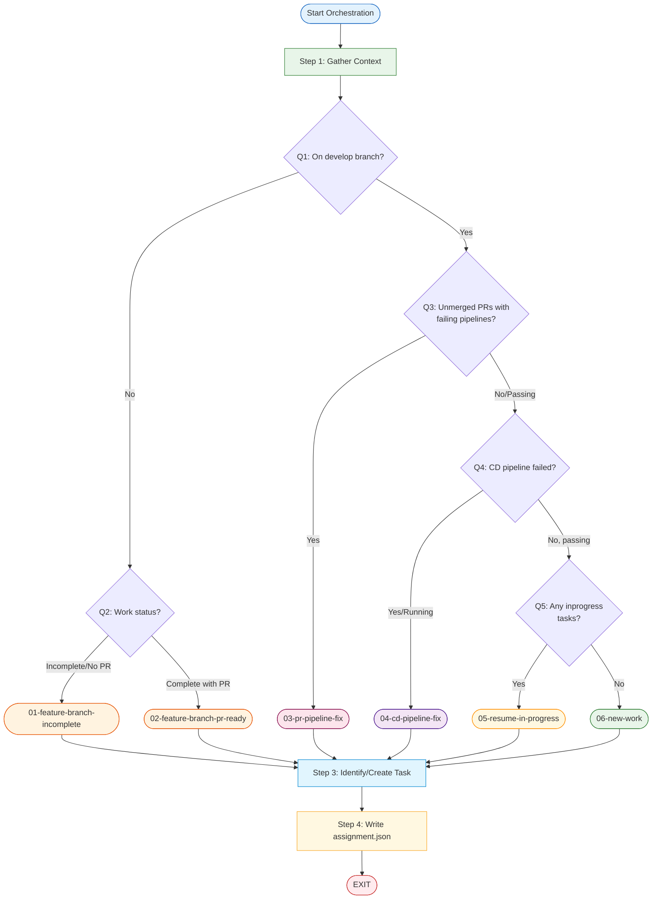

# Task

Your job is to determine which workflow to execute for the Background Assassins web application, identify or create the associated task, and write the assignment file.

## Workflow Selection Process

Follow these steps to select the appropriate workflow from `./.ralph/workflows/` and prepare the assignment.

### Step 1: Gather Context

Collect the following information:

1.1. Check the current git branch name

1.2. Get the Vibe Kanban project ID for this repository:
   ```
   mcp__vibe_kanban__list_projects()
   ```
   Find the project matching this git repository path and note the `project_id`.

1.3. If on `develop` branch:
   - Check for any unmerged PRs targeting `develop`
   - If PRs exist, check their CI/CD pipeline status
   - Check the CD pipeline status for the `develop` branch itself
   - Check for any in_progress tasks:
     ```
     mcp__vibe_kanban__list_tasks(project_id=<uuid>, status="inprogress")
     ```

1.4. If NOT on `develop` branch (feature/bugfix branch):
   - Check if a PR exists for this branch
   - Assess whether work appears complete or incomplete
   - Find the associated task

### Step 2: Select Workflow

Use this decision tree to select the appropriate workflow:

```
┌─────────────────────────────────────────────────────────────────────────────┐
│                           WORKFLOW SELECTION                                 │
├─────────────────────────────────────────────────────────────────────────────┤
│                                                                             │
│  Q1: Are you on the `develop` branch?                                       │
│  │                                                                          │
│  ├─ NO (on feature/bugfix branch)                                           │
│  │   │                                                                      │
│  │   └─ Q2: What is the work status?                                        │
│  │       │                                                                  │
│  │       ├─ Incomplete or no PR exists                                      │
│  │       │   └─► WORKFLOW: 01-feature-branch-incomplete                     │
│  │       │                                                                  │
│  │       └─ Complete with unmerged PR                                       │
│  │           └─► WORKFLOW: 02-feature-branch-pr-ready                       │
│  │                                                                          │
│  └─ YES (on develop)                                                        │
│      │                                                                      │
│      └─ Q3: Are there unmerged PRs with FAILING pipelines?                  │
│          │                                                                  │
│          ├─ YES                                                             │
│          │   └─► WORKFLOW: 03-pr-pipeline-fix                               │
│          │                                                                  │
│          └─ NO (no PRs, or all PRs have passing pipelines)                  │
│              │                                                              │
│              └─ Q4: Has the CD pipeline for develop FAILED?                 │
│                  │                                                          │
│                  ├─ YES (or still running - wait first)                     │
│                  │   └─► WORKFLOW: 04-cd-pipeline-fix                       │
│                  │                                                          │
│                  └─ NO (CD pipeline passing)                                │
│                      │                                                      │
│                      └─ Q5: Are there any tasks with                        │
│                             status "inprogress"?                            │
│                          │                                                  │
│                          ├─ YES                                             │
│                          │   └─► WORKFLOW: 05-resume-in-progress            │
│                          │                                                  │
│                          └─ NO                                              │
│                              └─► WORKFLOW: 06-new-work                      │
│                                                                             │
└─────────────────────────────────────────────────────────────────────────────┘
```

### Step 3: Identify or Create Task

Based on the selected workflow, identify or create the task to work on using Vibe Kanban MCP tools.

#### For Workflow 01 (feature-branch-incomplete) or 02 (feature-branch-pr-ready):
- Find the existing task associated with the current branch
- Search by listing in-progress tasks or check recent tasks that match the branch name/feature:
  ```
  mcp__vibe_kanban__list_tasks(project_id=<uuid>, status="inprogress")
  ```
- If no task is found, create one:
  ```
  mcp__vibe_kanban__create_task(
      project_id=<uuid>,
      title="[Feature/Fix description from branch]"
  )
  ```
  Then update its status:
  ```
  mcp__vibe_kanban__update_task(task_id=<uuid>, status="inprogress")
  ```

#### For Workflow 03 (pr-pipeline-fix):
- Create a new task for the pipeline fix:
  ```
  mcp__vibe_kanban__create_task(
      project_id=<uuid>,
      title="Fix failing CI/CD pipeline for PR #[number]"
  )
  ```
  Then update its status:
  ```
  mcp__vibe_kanban__update_task(task_id=<uuid>, status="inprogress")
  ```

#### For Workflow 04 (cd-pipeline-fix):
- Create a new task for the CD pipeline fix:
  ```
  mcp__vibe_kanban__create_task(
      project_id=<uuid>,
      title="Fix failing CD pipeline for develop branch"
  )
  ```
  Then update its status:
  ```
  mcp__vibe_kanban__update_task(task_id=<uuid>, status="inprogress")
  ```

#### For Workflow 05 (resume-in-progress):
- Use the in_progress task found in Step 1
- This is the highest priority task from the list_tasks query with status="inprogress"

#### For Workflow 06 (new-work):
- List available tasks ready to work on:
  ```
  mcp__vibe_kanban__list_tasks(project_id=<uuid>, status="todo")
  ```
- If there's an existing task ready to work on, use that task and update its status:
  ```
  mcp__vibe_kanban__update_task(task_id=<uuid>, status="inprogress")
  ```
- If no ready tasks exist, create a new task:
  ```
  mcp__vibe_kanban__create_task(
      project_id=<uuid>,
      title="[Brief description - will be updated during planning]"
  )
  ```
  Then update its status:
  ```
  mcp__vibe_kanban__update_task(task_id=<uuid>, status="inprogress")
  ```
- Note: The task details will be fleshed out during the workflow's planning phase

### Step 4: Write Assignment File (Handoff)

Create the assignment file at `./.ralph/planning/assignment.json`:

1. Ensure the directory exists:
   ```bash
   mkdir -p ./.ralph/planning
   ```

2. Write the JSON file with the following structure:
   ```json
   {
     "workflow": ".ralph/workflows/[XX-workflow-name].md",
     "task_id": "<task-uuid-from-vibe-kanban>"
   }
   ```

**Example assignments:**

```json
{
  "workflow": ".ralph/workflows/01-feature-branch-incomplete.md",
  "task_id": "ac7f8755-3ba5-4aaf-a514-8aef29b7d447"
}
```

```json
{
  "workflow": ".ralph/workflows/06-new-work.md",
  "task_id": "6dc586ed-924e-4223-bd5b-12d88b7a338a"
}
```

Once the assignment file is written, your job is complete. EXIT.

---

## Quick Reference

See `./.ralph/workflows/index.md` for a complete index of available workflows.

| # | Workflow | Trigger Condition | Task Action |
|---|----------|-------------------|-------------|
| 01 | feature-branch-incomplete | On feature branch + work incomplete | Find existing or create |
| 02 | feature-branch-pr-ready | On feature branch + unmerged PR exists | Find existing or create |
| 03 | pr-pipeline-fix | On develop + PR has failing CI/CD | Create new |
| 04 | cd-pipeline-fix | On develop + CD pipeline failed | Create new |
| 05 | resume-in-progress | On develop + has inprogress tasks | Use found task |
| 06 | new-work | On develop + nothing in progress | Pick from todo or create new |

---

## Assignment File Schema

**Location:** `./.ralph/planning/assignment.json`

```json
{
  "workflow": "string - relative path to workflow file from repo root",
  "task_id": "string - task UUID from Vibe Kanban"
}
```

---

## Vibe Kanban MCP Tools Reference

### List Projects
```
mcp__vibe_kanban__list_projects()
```
Returns all projects. Find the one matching this repository's git path.

### List Tasks
```
mcp__vibe_kanban__list_tasks(project_id=<uuid>, status="todo"|"inprogress"|"done")
```
Returns tasks filtered by status. Omit status to get all tasks.

### Get Task Details
```
mcp__vibe_kanban__get_task(task_id=<uuid>)
```
Returns full task details including description.

### Create Task
```
mcp__vibe_kanban__create_task(project_id=<uuid>, title="...", description="...")
```
Creates a new task. Description is optional.

### Update Task
```
mcp__vibe_kanban__update_task(task_id=<uuid>, status="todo"|"inprogress"|"inreview"|"done"|"cancelled")
```
Updates task status, title, or description.

---

## Workflow Decision Diagram


